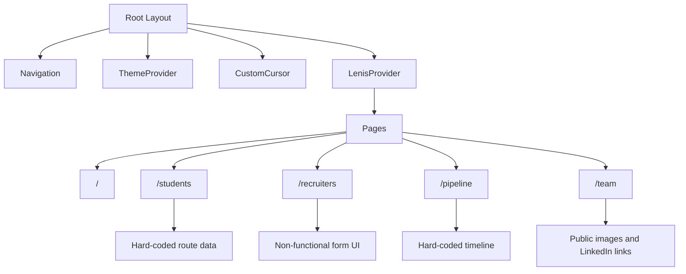

# NEXTURN Codebase Summary

## Executive Summary

NEXTURN is a visually ambitious placement-cell website for IITM. It currently functions as a static, animation-heavy product showcase rather than a complete placement platform.

Implemented capabilities include:

- Student job listings
- Recruiter information and contact form UI
- Placement pipeline timeline
- Team directory
- Roadmap PDF resources
- Theme switching
- Responsive layouts
- Scroll and hover animations

There is currently no backend, database, authentication, live data, form processing, or real analytics integration.

## System Design

The project uses the Next.js App Router.



The global application shell is defined in [src/app/layout.tsx](src/app/layout.tsx). It provides:

- Metadata
- Inter font
- Theme context
- Navigation
- Custom cursor
- Theme toggle
- Lenis smooth scrolling

Each route is largely implemented as a client component. Most content is hard-coded directly inside the route files:

- [src/app/page.tsx](src/app/page.tsx)
- [src/app/students/page.tsx](src/app/students/page.tsx)
- [src/app/recruiters/page.tsx](src/app/recruiters/page.tsx)
- [src/app/pipeline/page.tsx](src/app/pipeline/page.tsx)
- [src/app/team/page.tsx](src/app/team/page.tsx)

There are no API routes, server actions, database clients, environment variables, authentication flows, or external CMS integrations.

## Implemented Routes

### `/`

- NEXTURN hero animation
- Interactive 3D cube
- Register Drive CTA
- Pipeline navigation CTA
- Partner marquee
- Animated placement statistics
- Static Top Talent cards
- LinkedIn and Instagram links
- Organization footer

### `/students`

- Static job board
- Expandable preparation roadmaps
- Roadmap PDF previews on desktop
- Roadmap downloads on mobile
- Placeholder analytics logging

### `/recruiters`

- Recruitment process timeline
- Company information form
- Contact email field
- Required roles field

The form currently has no submission handler or backend integration.

### `/pipeline`

- Placement event timeline
- Scroll progress indicator
- Event sidebar
- RSVP inputs and buttons

RSVP actions are currently visual only and do not submit data.

### `/team`

- Founders section
- Core team section
- Horizontal pinned scrolling
- Team portraits
- Flip-card interactions
- Member detail modal
- LinkedIn links

The navigation includes a `CONTACT` link, but no matching `#contact` section appears to exist.

## UI/UX and Design System

The design direction is editorial brutalism:

- Heavy black borders
- Offset shadows
- Large uppercase typography
- Neon green dark theme
- Cream, navy, amber, and orange light theme
- Strong hover inversion effects
- Animated page transitions
- Magnetic buttons
- Custom cursor
- Text scrambling
- Marquee content
- Scroll-triggered animations
- 3D cube interaction
- Team card flips
- Horizontal scrolling sections

The visual identity is distinctive and consistent. The interface clearly separates the main audiences: students, recruiters, the placement pipeline, and the team.

The main design system and theme tokens are centralized in [src/app/globals.css](src/app/globals.css).

### UX Concerns

- Motion is used almost everywhere.
- There is no `prefers-reduced-motion` support.
- The custom cursor is primarily desktop-oriented.
- Several clickable elements are non-semantic `<div>` elements.
- Team interactions are not clearly keyboard-accessible.
- The modal lacks proper dialog semantics and focus management.
- Heavy uppercase styling can reduce readability.
- Theme initialization can cause a flash between themes.
- Statistics appear factual but have no source or update date.
- The landing-page Register Drive button does not currently perform an action.
- PDF `<embed>` support and accessibility vary between browsers.

## Technology Stack

- Language: TypeScript and TSX
- Framework: Next.js `16.2.6`
- UI: React `19.2.4`
- Styling: Tailwind CSS `4`
- Font: Inter through `next/font/google`
- Animation: Framer Motion and GSAP with ScrollTrigger
- Smooth scrolling: Lenis
- Icons: Lucide React
- Build tooling: Turbopack
- Linting: ESLint 9 and `eslint-config-next`
- Type checking: TypeScript 5
- Package manager evidence: Bun lockfile
- Configuration: `next.config.ts`, `tsconfig.json`, `eslint.config.mjs`, and `postcss.config.mjs`

Dependency and script definitions are in [package.json](package.json).

One suspicious detail is the `"dev": "^0.1.5"` runtime dependency, which appears unrelated to the project and may be accidental.

## Code Quality and Risks

### Validation Status

The production build succeeds:

```text
Compiled successfully
Finished TypeScript
Generating static pages
8/8 pages generated
```

Lint currently fails with six errors and one warning:

- JSX comment issue in the pipeline page
- Three uses of `any` in the team page
- Synchronous state update inside the theme effect
- Invalid `@ts-ignore`
- Unused callback variable in `TextScramble`

### Maintainability Risks

- All application data is embedded in page components.
- Most pages are client components, increasing browser JavaScript.
- GSAP selectors are broad and global.
- Global `ScrollTrigger` cleanup may affect unrelated components.
- Lenis ticker cleanup appears incorrect.
- `Member.imageStyle` uses weak typing.
- There are no automated tests.
- There is no CI configuration.
- The README remains the default create-next-app documentation.

### Accessibility Risks

- Icon-only navigation controls need accessible labels.
- Clickable containers should be replaced with buttons or links.
- The member modal needs dialog semantics and keyboard support.
- Form fields need labels, names, required states, and error messages.
- Reduced-motion support is missing.
- Custom cursor behavior does not meaningfully support keyboard or touch users.
- PDF embeds have limited accessibility.

### Performance Risks

- Every page is heavily client-side.
- Several animation libraries are loaded into the application.
- The home page uses broad global selectors such as `.hero-text`, `.stat-number`, and `.parallax-card`.
- Team scrolling updates React state during scroll.
- No bundle analysis, Lighthouse report, or device performance testing exists.

### Security and Production Risks

The current security risk is relatively low because there is no server-side data handling. Production readiness is incomplete because there are:

- No security headers or Content Security Policy
- No authentication or authorization
- No server-side validation
- No rate limiting or abuse protection
- Hard-coded external links and public profile assets
- No centralized content management

Future form processing should include server-side validation, authorization, CSRF protection where relevant, rate limiting, and spam protection.

## Missing Production Features

1. Real recruiter form submission
2. RSVP submission and event registration
3. Database-backed jobs, events, statistics, and team data
4. Admin interface or CMS
5. Authentication and authorization
6. Form validation and abuse protection
7. Loading, success, and failure states
8. Accessibility improvements
9. Reduced-motion handling
10. Route-level metadata and Open Graph images
11. `robots.txt` and sitemap
12. `error.tsx`, `loading.tsx`, and `not-found.tsx`
13. Automated tests
14. CI/CD configuration
15. Production security headers and Content Security Policy
16. Updated project documentation

## Recommended Development Order

1. Fix the current lint errors.
2. Define the product data model for jobs, recruiters, events, and applications.
3. Add backend storage and server-side validation.
4. Connect recruiter submissions and RSVP flows.
5. Add authentication for administrative actions.
6. Improve keyboard, modal, form, and reduced-motion accessibility.
7. Move static content into Server Components where possible.
8. Add tests for navigation, forms, theme persistence, modal behavior, and accordions.
9. Add SEO, error states, sitemap, and deployment documentation.
10. Update [README.md](README.md) to document the actual system.

## Important Files

- [Root layout and metadata](src/app/layout.tsx)
- [Global design tokens and CSS utilities](src/app/globals.css)
- [Home experience](src/app/page.tsx)
- [Recruiter workflow](src/app/recruiters/page.tsx)
- [Student job board and roadmap UI](src/app/students/page.tsx)
- [Pipeline timeline and RSVP UI](src/app/pipeline/page.tsx)
- [Team experience](src/app/team/page.tsx)
- [Shared navigation](src/components/Navigation.tsx)
- [Theme state and persistence](src/components/ThemeProvider.tsx)
- [Smooth-scroll integration](src/components/LenisProvider.tsx)
- [Global cursor interaction](src/components/CustomCursor.tsx)
- [Animation primitives](src/components/InteractiveCube.tsx), [MagneticButton.tsx](src/components/MagneticButton.tsx), [Marquee.tsx](src/components/Marquee.tsx), and [TextScramble.tsx](src/components/TextScramble.tsx)
- [Dependencies and scripts](package.json)
- [TypeScript configuration](tsconfig.json)
- [ESLint configuration](eslint.config.mjs)
- [Next configuration](next.config.ts)
- [Static portraits and roadmap documents](public)
